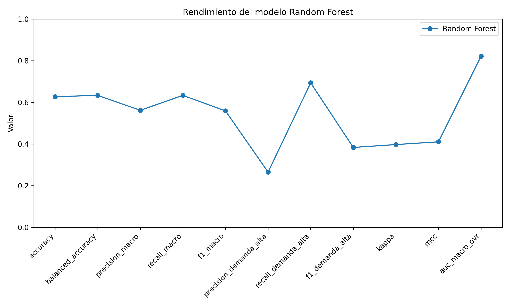
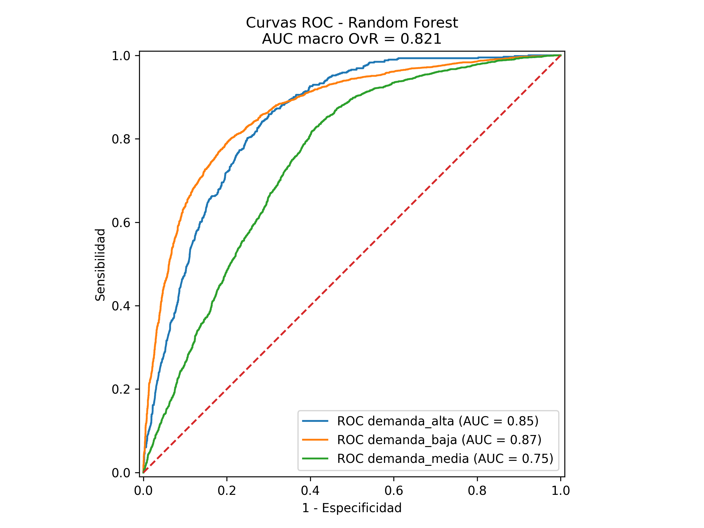
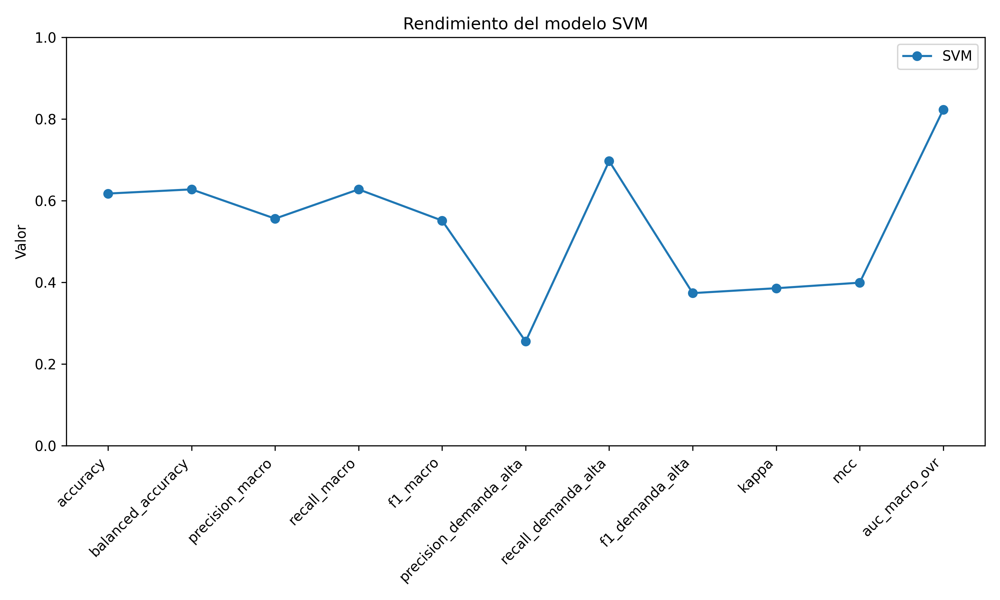
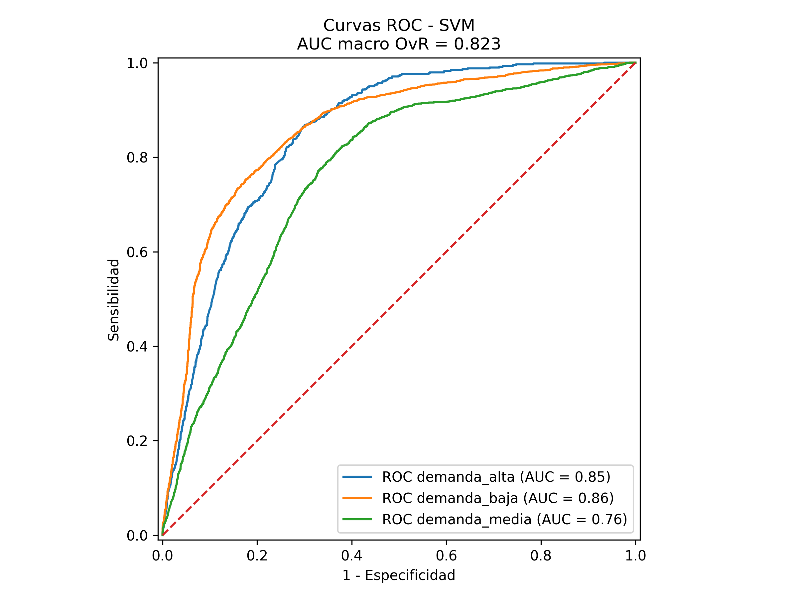

# ML - Índice de Demanda Digital

Proyecto para la asignatura de aprendizaje automático supervisado orientado a predecir el nivel de demanda digital de artistas de Spotify a partir de variables musicales, trayectoria discográfica y métricas de actividad.

El objetivo principal es clasificar artistas en distintos niveles de demanda digital mediante modelos supervisados, comparando su rendimiento y analizando la importancia de las variables predictoras.

---

## 1. Descripción del proyecto

Este proyecto desarrolla un flujo completo de modelado supervisado aplicado a datos de artistas de Spotify. La variable objetivo es un **Índice de Demanda Digital (IDD)** construido a partir de tres indicadores:

- Popularidad del artista en Spotify.
- Número de seguidores.
- Oyentes mensuales.

A partir de este índice, los artistas se clasifican en tres niveles:

- `demanda_baja`
- `demanda_media`
- `demanda_alta`

Posteriormente, se entrenan y comparan distintos modelos de clasificación para predecir dicho nivel de demanda digital.

---

## 2. Fuente de datos

La base de datos procede de la combinación de dos datasets publicados en Kaggle por Sarah Jeffreson:

- **Featured Spotify artists/tracks with metadata**:https://www.kaggle.com/datasets/sarahjeffreson/featured-spotify-artiststracks-with-metadata
- **Large random Spotify artist sample with metadata**: https://www.kaggle.com/datasets/sarahjeffreson/large-random-spotify-artist-sample-with-metadata

La combinación de ambas fuentes permite trabajar con una muestra más amplia y con mayor representación de artistas de distintos niveles de popularidad.

Las variables originales incluyen, entre otras:

| Variable | Descripción |
|---|---|
| `ids` | Identificador único del artista en Spotify |
| `names` | Nombre artístico |
| `monthly_listeners` | Oyentes mensuales |
| `popularity` | Popularidad según Spotify |
| `followers` | Número de seguidores |
| `genres` | Géneros musicales asociados |
| `first_release` | Año del primer lanzamiento |
| `last_release` | Año del último lanzamiento |
| `num_releases` | Número de lanzamientos |
| `num_tracks` | Número de canciones |

---

## 3. Construcción del Índice de Demanda Digital

El **Índice de Demanda Digital (IDD)** se construyó a partir de las variables:

- `popularity`
- `followers`
- `monthly_listeners`

Dado que `followers` y `monthly_listeners` presentaban una fuerte asimetría positiva, se aplicó una transformación logarítmica antes de estandarizar las variables. Posteriormente, se combinó la información para generar un índice continuo de demanda digital.

El índice fue recodificado en tres clases:

- **Demanda baja**: artistas por debajo del percentil 50 del IDD.
- **Demanda alta**: artistas por encima del percentil 85 del IDD y con popularidad igual o superior a 60.
- **Demanda media**: casos intermedios.

Esta decisión introduce una clasificación más interpretable, aunque también genera un problema relevante de **desbalanceo entre clases**, especialmente por la menor representación de artistas de demanda alta.

---

## 4. Preprocesamiento

El preprocesamiento incluyó:

- Eliminación de duplicados.
- Tratamiento de valores perdidos.
- Revisión de valores implausibles.
- Transformación logarítmica de variables altamente asimétricas.
- Estandarización de variables numéricas.
- Construcción de variables derivadas de trayectoria musical.
- Agrupación de géneros musicales en macro-géneros.

### Agrupación de géneros

### Agrupación de géneros

La variable `genres` presentaba una elevada dispersión debido a la gran cantidad de etiquetas musicales específicas. Para hacerla operativa en el modelado, se aplicó un procedimiento semiautomatizado basado en embeddings semánticos mediante **Ollama** y el modelo `bge-m3`.

El resultado fue una clasificación de los géneros en 12 macro-géneros más interpretables.


---

## 5. Modelos entrenados

En el proyecto se entrenaron y compararon distintos modelos de clasificación supervisada:

- Support Vector Machine, SVM.
- Random Forest.
- Modelos exploratorios mediante PyCaret.
- Modelos con balanceo de clases.

El problema se aborda como una tarea de **clasificación multiclase**, donde la variable objetivo es el nivel de demanda digital.

---

## 6. Resultados

### Comparación de métricas: Random Forest



### Curva ROC: Random Forest



### Comparación de métricas: SVM



### Curva ROC: SVM



Estos resultados muestras rendimientos similares.

---

### Matrices de confusión

Las matrices de confusión permiten observar en qué clases de demanda digital se concentran los aciertos y los errores de clasificación.

#### Matriz de confusión: Random Forest


#### Matriz de confusión: SVM


## 7. Importancia de variables

El modelo Random Forest permite estimar la importancia relativa de las variables predictoras. Los resultados se encuentran en:

```text
importancia_variables_random_forest.csv
